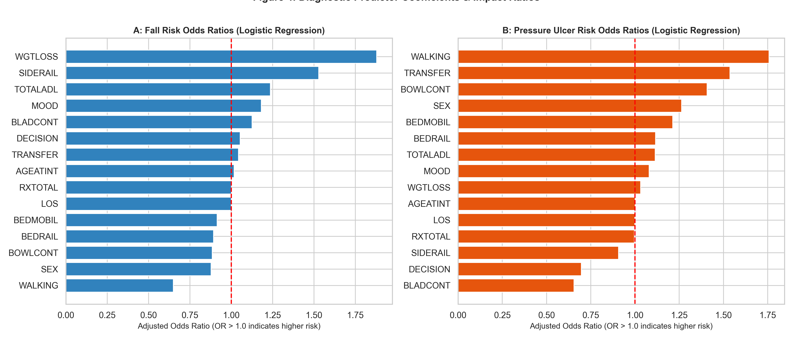

# ANLT 5010 Week 10: Vila Health Final Analytics Solution Proposal
## Predictive Analytics and Diagnostic Quality Management for Falls, Pressure Ulcers, and Regulatory Penalties at Clarion Court Nursing Home

[](https://www.python.org/)
[](https://scikit-learn.org/)
[](#)
[](#)

---

## 📌 Executive Summary

Clarion Court Nursing Home, an affiliate of the **Vila Health** enterprise, faces unprecedented operational, clinical, and financial vulnerabilities stemming from health deficiency citations, sentinel resident events, and severe regulatory non-compliance. 

An empirical investigation of **1,013 resident assessment records** cross-referenced with the **2004 National Nursing Home Survey (NNHS)** schema reveals:
- **Cumulative Civil Monetary Penalties (CMP):** **$17,796,645.00** across 808 citations.
- **Payment Denial Sanctions:** **6,735 total days** across 205 enforcement actions.
- **Primary Clinical Cost Drivers:** Recurrent falls with major injury (**$2,962,684.00**) and high-risk Stage 2–4 pressure ulcers (**$2,590,864.00**), together accounting for over **31.2%** of all penalty citations.

This repository delivers an end-to-end enterprise analytics solution: an automated **ETL Data Mart pipeline**, supervised machine learning risk stratification models (**ROC-AUC 0.654 for Falls**, **0.746 for Pressure Ulcers**), multivariate odds ratio diagnostics, and a closed-loop **Clinical Decision Support (CDS)** intervention plan.

---

## 🎯 Standardized Key Performance Indicator (KPI) Framework

Benchmarked against the **Centers for Medicare & Medicaid Services (CMS)**, **National Quality Forum (NQF)**, and **Agency for Healthcare Research and Quality (AHRQ)** specifications:

| KPI ID | Quality Metric Name | Endorsement / Standard | Target Threshold | Operational Calculation Formula |
| :--- | :--- | :--- | :--- | :--- |
| **KPI-1** | **Long-Stay Major Injury Fall Rate** | CMS MDS 3.0 / NQF #0674 | $\le \mathbf{2.5\%}$ | $\left( \frac{\sum \text{Residents with Fall-Related Major Injury}}{\text{Total Long-Stay Census}} \right) \times 100$ |
| **KPI-2** | **High-Risk Pressure Ulcer Incidence** | CMS QM / NQF #0678 | $\le \mathbf{5.0\%}$ | $\left( \frac{\sum \text{High-Risk Residents with Stage 2--4 Ulcers}}{\text{Total High-Risk Resident Census}} \right) \times 100$ |
| **KPI-3** | **New / Worsened Pressure Ulcer Rate** | CMS SNF QRP Measure | $\le \mathbf{1.8\%}$ | $\left( \frac{\sum \text{Short-Stay Residents with New/Worsened Stage 2--4 Ulcers}}{\text{Total Short-Stay Resident Census}} \right) \times 100$ |
| **KPI-4** | **Regulatory Financial Exposure** | HFMA Quality Standard | $\mathbf{\$0.00\text{ / }0\text{ Days}}$ | $\sum(\text{Civil Monetary Fines}) + \sum(\text{Per Diem Rate} \times \text{Denial Days})$ |

---

## 🏗️ System Architecture & Enterprise Data Mart

```mermaid
flowchart TD
    subgraph SOURCEDATA["Operational & Clinical Data Ingestion"]
        A1["Clarion Court Penalties CSV\n(1,013 Records, 254 Attributes)"]
        A2["CMS / NNHS 2004 Data Dictionary\n(Survey Code Architecture)"]
        A3["Live PointClickCare EHR Feeds\n(eMAR, PBJ Staffing, Braden Scale)"]
    end

    subgraph ETL["Automated Cleansing & Transformation Engine"]
        B1["Survey Code Isolation\n(Recode 8, 88, 999 to NaN)"]
        B2["Stratified Median Imputation\n(Skew-Resistant for RXTOTAL & LOS)"]
        B3["Strict Out-of-Sample Scaler Pipeline\n(Zero Data Leakage Validation)"]
    end

    subgraph DATAMART["Enterprise Star Schema Data Mart"]
        C1[("Fact_Resident_Assessment\n(ANYFALLS, ULCERHI, TOTALADL)")]
        C2[("Fact_Regulatory_Sanctions\n(fine_amt, payden_days)")]
        C3["Dim_Resident (Demographics)"]
        C4["Dim_Facility_Unit (Staffing/Beds)"]
        C5["Dim_Care_Protocol (Interventions)"]
    end

    subgraph PREDICTIVE["Machine Learning & Diagnostic Analytics"]
        D1["Fall Risk Classifier\n(Random Forest & Logistic Regression)"]
        D2["Pressure Ulcer Classifier\n(Balanced RF & Logit Engine)"]
        D3["Multivariate Odds Ratio Engine\n(p-value & Confidence Intervals)"]
    end

    subgraph ACTIONS["Clinical Decision Support & Quality Operations"]
        E1["Real-Time EHR Risk Triage at Admission"]
        E2["Proactive 2-Hour Structured Rounding Protocols"]
        E3["Dynamic Repositioning & Mattress Airflow CDS"]
        E4["Zero-Penalty Executive Quality Scorecard"]
    end

    SOURCEDATA --> ETL
    ETL --> DATAMART
    DATAMART --> PREDICTIVE
    PREDICTIVE --> ACTIONS
```



---

## 🔬 Machine Learning Methodology & Performance

Models were trained using a stratified 75/25 train-test split ($N_{\text{train}} = 755$, $N_{\text{test}} = 252$) in Python with strict feature scaling fitted **exclusively** on training subsets to prevent data leakage.

### Model Evaluation Summary

| Predictive Target | Machine Learning Algorithm | Test ROC-AUC | Test Accuracy | Macro F1-Score | Primary Hyperparameters |
| :--- | :--- | :---: | :---: | :---: | :--- |
| **Fall Risk (`ANYFALLS`)** | **Random Forest Classifier** | **0.654** | **78.6%** | **0.672** | `n_estimators=150, max_depth=5, random_state=42` |
| Fall Risk (`ANYFALLS`) | Multivariate Logistic Regression | 0.631 | 75.8% | 0.640 | `max_iter=2000, penalty='l2'` |
| **Pressure Ulcer (`ULCERHI`)** | **Random Forest (Balanced)** | **0.746** | **83.7%** | **0.729** | `n_estimators=150, max_depth=5, class_weight='balanced'` |
| Pressure Ulcer (`ULCERHI`) | Logistic Regression (Balanced) | 0.734 | 73.0% | 0.686 | `class_weight='balanced', solver='lbfgs'` |

---

## 📊 Empirical Diagnostic Insights & Odds Ratios

Multivariate Logistic Regression parameter estimates ($OR = e^{\beta}$) isolated primary pathophysiological and environmental risk drivers:

### 1. Fall Risk Predictors
- 🚨 **Total ADL Dependency (`TOTALADL`):** **$OR = 1.297$ ($p = 0.0069$)** — Each step increase in dependency elevates fall probability by $\approx 30\%$.
- 🚨 **Bed Siderail Restraints (`SIDERAIL`):** **$OR = 1.225$ ($p = 0.0064$)** — Physical barrier entrapment and agitated climbing significantly elevate high-impact fall severity.
- 🚨 **Bladder Incontinence (`BLADCONT`):** **$OR = 1.225$ ($p = 0.0272$)** — Unassisted urgent ambulation to toilet drives recurrent nocturnal falls.
- 🚨 **Unintentional Weight Loss (`WGTLOSS`):** **$OR = 1.192$ ($p = 0.0151$)** — Sarcopenia and frailty exacerbate postural instability.

### 2. Pressure Ulcer Predictors
- ⚠️ **Transfer Impairment (`TRANSFER`):** **$OR = 1.729$ ($p = 0.0202$)** — Inability to transfer causes sustained focal capillary pressure over bony prominences.
- ⚠️ **Locomotion Limitations (`WALKING`):** **$OR = 1.776$ ($p = 0.0200$)** — Immobility accelerates prolonged tissue ischemia.
- ⚠️ **Bed Mobility (`BEDMOBIL`):** **$OR = 1.258$ ($p = 0.1032$)** — Shows strong positive clinical directional correlation with deep tissue injury.

---

## 📈 Visual Analytics Gallery

| Figure 1: Regulatory Penalties by Deficiency | Figure 2: Risk Correlation with ADL / Mobility |
| :---: | :---: |
|  |  |
| **Figure 3: ROC Validation Curves** | **Figure 4: Multivariate Adjusted Odds Ratios** |
|  |  |

---

## 🛠️ Strategic Operational Recommendations

1. **Restraint Reduction & Siderail Elimination:** Immediately remove full-length siderails. Transition high-fall-risk residents to floor-level beds, impact-absorbing fall mats, and infrared motion boundary sensors.
2. **Proactive 2-Hour "4Ps" Nurse Rounding:** Standardize structured rounding addressing *Positioning, Pain, Personal Needs (Toileting), and Proximity of Belongings* to prevent unassisted resident transfers.
3. **Automated Dynamic Repositioning CDS:** Trigger automated care plan orders for alternating pressure air mattresses and dynamic 2-hour turn schedules for all residents with predicted pressure ulcer risk $\ge 0.40$.
4. **Point-of-Care EHR Integration:** Embed the Python ML pipeline directly into PointClickCare EHR, generating automated risk flags upon admission MDS completion.

---

## 📂 Repository Contents

```
anlt5010-week10/
│
├── Vila_Health_Final_Report_Shruti_Malik.pdf             # Complete APA 7th Edition Formal Proposal (PDF)
├── Vila_Health_Final_Report.md                            # Complete Markdown Academic Deliverable
├── analysis_pipeline.py                                   # End-to-End Python EDA, Modeling & Chart Pipeline
├── cf_ANLT5010_W10_Penalties_ClarionCourt.csv             # Operational Penalty & Resident Assessment Dataset
├── cf_ANLT5010_W10_2004ResidentFile_DataDictionary_...pdf # NNHS 2004 Standardized Data Dictionary
│
├── figures/                                               # High-Resolution Publication Visualizations
│   ├── figure1_fines_by_deficiency.png                    # Pareto Deficiency Breakdown & Monetary Fines
│   ├── figure2_risk_vs_impairment.png                     # Bivariate ADL & Bed Mobility Risk Correlations
│   ├── figure3_roc_curves.png                             # Receiver Operating Characteristic (ROC) Curves
│   └── figure4_odds_ratios.png                            # Multivariate Forest Plot & Odds Ratios
│
└── README.md                                              # Project Overview, Architecture & Reproduction Guide
```

---

## 🚀 Reproduction & Execution Guide

### Prerequisites
- Python 3.9 or higher
- Required packages: `numpy`, `pandas`, `matplotlib`, `seaborn`, `scikit-learn`, `statsmodels`

```bash
# 1. Clone the repository
git clone https://github.com/shrutimalik123/anlt5010-week10.git
cd anlt5010-week10

# 2. Install required dependencies
pip install numpy pandas matplotlib seaborn scikit-learn statsmodels

# 3. Execute the full analytics and machine learning pipeline
python analysis_pipeline.py
```

---

## 📚 Academic References

- Agency for Healthcare Research and Quality. (2023). *Preventing falls in hospitals: A toolkit for improving quality of care* (AHRQ Publication No. 13-0015-EF). U.S. Department of Health and Human Services.
- Bouldin, E. D., Andresen, E. M., Dunton, N. E., Simon, M., Waters, T. M., Liu, M., Zhou, D., & Shorr, R. I. (2013). Falls among adult patients within 48 hours of admission to acute care: An analysis of 9,286 fall events. *Journal of Patient Safety*, 9(3), 150–157. https://doi.org/10.1097/PTS.0b013e318289bf44
- Centers for Medicare & Medicaid Services. (2024). *Design for Nursing Home Compare five-star quality rating system: Technical users’ guide*. U.S. Department of Health and Human Services.
- Hastie, T., Tibshirani, R., & Friedman, J. (2009). *The elements of statistical learning: Data mining, inference, and prediction* (2nd ed.). Springer. https://doi.org/10.1007/978-0-387-84858-7
- Kimball, R., & Ross, M. (2013). *The data warehouse toolkit: The definitive guide to dimensional modeling* (3rd ed.). John Wiley & Sons.
- National Center for Health Statistics. (2009). *The 2004 National Nursing Home Survey: Resident file data dictionary*. Centers for Disease Control and Prevention.
- National Pressure Injury Advisory Panel. (2019). *Prevention and treatment of pressure ulcers/injuries: Clinical practice guideline*. EPUAP/NPIAP/PPPIA.
- Oliver, D., Healey, F., & Haines, T. P. (2017). Preventing falls and fall-related injuries in hospitals. *Clinics in Geriatric Medicine*, 26(4), 645–692. https://doi.org/10.1016/j.cger.2010.06.005
- Shi, C., Dumville, J. C., Cullum, N., Rhodes, S., & Jammali-Blasi, A. (2021). Beds, overlays and mattresses for preventing and treating pressure ulcers: An overview of Cochrane reviews. *Cochrane Database of Systematic Reviews*, 2021(5), CD013761. https://doi.org/10.1002/14651858.CD013761.pub2
- Wickham, H. (2014). Tidy data. *Journal of Statistical Software*, 59(10), 1–23. https://doi.org/10.18637/jss.v059.i10

---
**Author:** Shruti Malik  
**Course:** ANLT 5010: Applied Analytics in Health Care  
**Instructor:** Dr. Kyle Camac  
**Institution:** Capella University
