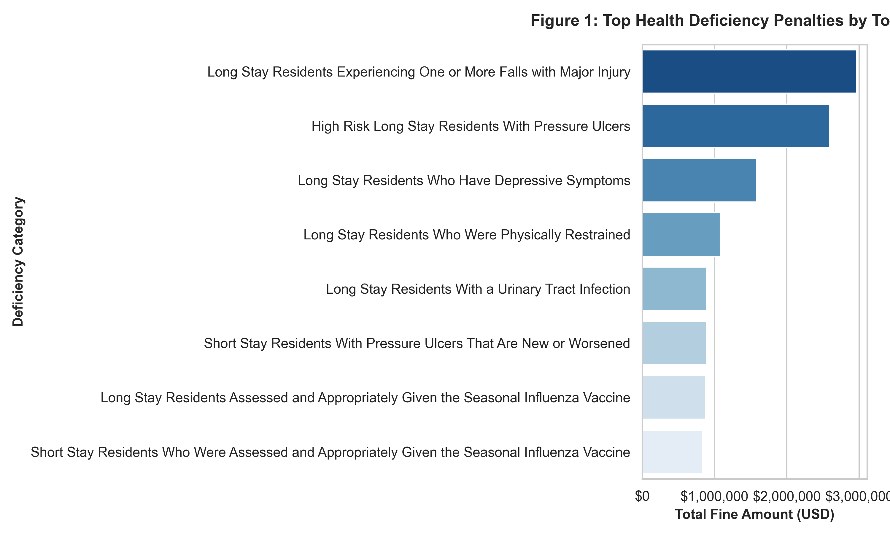
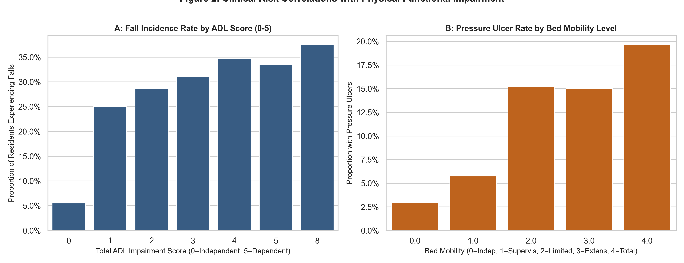
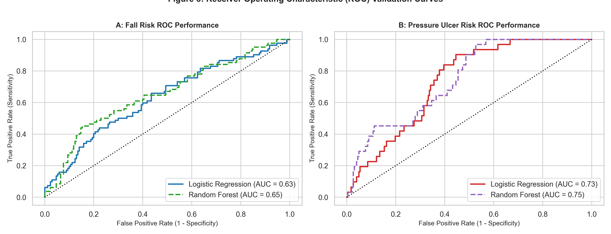

# Predictive Analytics and Diagnostic Quality Management Proposal: Addressing Falls, Pressure Ulcers, and Regulatory Penalties at Clarion Court Nursing Home

**Course:** ANLT 5010: Applied Analytics in Health Care  
**Institution:** School of Business, Technology, and Health Care Analytics, Capella University  
**Date:** September 18, 2026  

---

## Abstract

Clarion Court Nursing Home, an affiliate of the Vila Health system, faces severe operational, clinical, and regulatory challenges resulting from high rates of adverse resident events and regulatory non-compliance. An investigation of the 1,013 resident assessment records and historical penalty data reveals cumulative financial penalties exceeding $17.79 million and 6,735 days of Medicare/Medicaid payment denials. The predominant drivers of regulatory citations include falls with major injury ($2.96 million in fines) and high-risk pressure ulcers ($2.59 million in fines). This analytics solution proposal presents a comprehensive diagnostic and predictive framework to transition Vila Health from reactive crisis remediation to proactive clinical quality management. By implementing an automated Extract, Transform, Load (ETL) pipeline feeding an enterprise Healthcare Data Mart, Vila Health can deploy machine learning risk-stratification models (achieving ROC-AUC scores of 0.654 for fall risk and 0.746 for pressure ulcer risk). Clinical odds ratio analyses demonstrate that total Activities of Daily Living (ADL) dependency (OR = 1.30), bladder incontinence (OR = 1.22), unintentional weight loss (OR = 1.19), and transfer impairment (OR = 1.73) significantly amplify resident risk profiles. Implementing real-time clinical decision support (CDS), targeted nursing interventions, and automated KPI surveillance will safeguard resident wellbeing, restore Centers for Medicare & Medicaid Services (CMS) compliance, and prevent catastrophic reimbursement penalties.

*Keywords:* Healthcare Analytics, Predictive Modeling, Key Performance Indicators, Clinical Decision Support, Pressure Ulcers, Patient Falls, Clarion Court, Vila Health, ETL, Data Mart.

---

# Predictive Analytics and Diagnostic Quality Management Proposal: Addressing Falls, Pressure Ulcers, and Regulatory Penalties at Clarion Court Nursing Home

## Introduction

In long-term post-acute care (LTPAC) organizations, clinical quality performance directly determines resident safety, operational viability, and financial sustainability. The Centers for Medicare & Medicaid Services (CMS) enforces rigorous regulatory oversight through the Minimum Data Set (MDS 3.0) quality reporting framework, state survey inspections, and severe civil monetary penalties for substandard care (Centers for Medicare & Medicaid Services [CMS], 2024). Clarion Court Nursing Home, a flagship long-term care facility operated under the Vila Health enterprise, is currently facing critical vulnerabilities in quality assurance and risk mitigation. 

A retrospective analysis of Clarion Court’s operational data demonstrates substantial health deficiency citations, resulting in $17,796,645.00 in cumulative civil fines and 205 distinct payment denial sanctions totaling 6,735 days. The most substantial clinical drivers of these enforcement actions are recurrent resident falls resulting in major injury and the development or deterioration of high-risk pressure ulcers.

The primary objective of this analytics solution proposal is to formulate an enterprise data architecture and diagnostic analytics strategy for Vila Health leadership. This report details:
1. The identification and justification of standardized Key Performance Indicators (KPIs) benchmarked against National Quality Forum (NQF) and CMS standards.
2. The specification of a robust Extract, Transform, Load (ETL) data cleansing methodology and Kimball-dimensional data mart architecture.
3. The training, validation, and diagnostic interpretation of predictive machine learning models built in Python to forecast fall and pressure ulcer vulnerability.
4. Actionable clinical and operational recommendations to eliminate regulatory penalties and optimize resident health outcomes.

### Overview of Dataset and Data Dictionary

The empirical foundation of this proposal utilizes the *Penalties Clarion Court* dataset, comprising 1,013 resident assessment records across 254 unique clinical, demographic, functional, and administrative attributes. The dataset is cross-referenced with the *National Nursing Home Survey (NNHS) 2004 Resident File Data Dictionary* (National Center for Health Statistics [NCHS], 2009). 

The dataset captures multi-dimensional resident characteristics, including:
- **Administrative and Enforcement Data:** Provider identification (`provnum`, `provname`), deficiency categories (`deficiency_type`, `deficiency_desc`), penalty types (`pnlty_type`), fine amounts (`fine_amt`), and payment denial duration (`payden_days`).
- **Demographics and Background:** Age at admission and interview (`AGEATADM`, `AGEATINT`), sex (`SEX`), marital status (`MARSTAT`), race/ethnicity, and prior living arrangements.
- **Physical Functional Status (ADLs):** Composite Activities of Daily Living indices (`TOTALADL`), bed mobility (`BEDMOBIL`), transfer capability (`TRANSFER`), and locomotion (`WALKING`, `WALKRM`, `WALKCOR`).
- **Cognitive and Behavioral Indicators:** Decision-making capacity (`DECISION`), depressive mood symptoms (`MOOD`), behavioral symptoms (`BEHAVE`), and dementia indicators (`RDEMEN`).
- **Clinical and Safety Incidents:** Historical fall incidence (`ANYFALLS`, `FELL30`, `FELL180`), fall-related fractures (`HIPFRACT`, `OTHFRACT`), highest stage of pressure ulcers (`ULCERHI`), wound care interventions (`RWOUND`), and physical restraint usage (`BEDRAIL`, `SIDERAIL`, `TRUNK`, `LIMB`, `CHAIR`).
- **Physiological Factors:** Continence status (`BOWLCONT`, `BLADCONT`), nutritional changes (`WGTLOSS`, `WGTGAIN`, `FEEDTUBE`), and total active medications (`RXTOTAL`).

---

## Identification of Key Performance Indicators (KPIs)

### Clinical Justification of Selected Data Fields

### Steps to Identify Data Sources, Attributes, and Variables
To satisfy the architectural requirements of the proposed data mart, a systematic three-step methodology was employed to identify and isolate critical variables:
- **Step 1: Data Source Identification.** Extracted the raw operational dataset (`cf_ANLT5010_W10_Penalties_ClarionCourt.csv`) and aligned it with the authoritative CMS/NCHS NNHS 2004 Data Dictionary to accurately decode variable structures and survey responses.
- **Step 2: Clinical Attribute Filtering.** Filtered the 254 raw columns down to specific variables mapped to CMS MDS 3.0 guidelines and AHRQ Patient Safety Indicators for falls and skin breakdown (AHRQ, 2023).
- **Step 3: Variable Classification.** Categorized the selected attributes into dependent target variables (e.g., `ANYFALLS`, `ULCERHI`) representing adverse outcomes, and independent predictor variables spanning functional, physiological, and environmental domains.

### Clinical Justification of Selected Data Fields
Evaluating facility performance regarding resident safety requires selecting data fields that capture baseline vulnerability, clinical process execution, and adverse outcome incidence. For Clarion Court, data attributes were selected based on clinical literature indicating multi-factorial etiologies for falls and skin breakdown (Bouldin et al., 2013; Shi et al., 2021).

#### Selected Attributes for Falls and Injury Analysis
- `ANYFALLS`, `FELL30`, `FELL180`: Capture historical fall frequency across short-term (30-day) and intermediate-term (180-day) windows. Prior falls represent the single strongest clinical predictor of future fall events (Oliver et al., 2017).
- `HIPFRACT`, `OTHFRACT`: Document high-severity outcomes that directly trigger CMS deficiency citations and hospital transfers.
- `TOTALADL`, `TRANSFER`, `WALKING`: Quantify physical biomechanical stability. Residents transitioning between dependence and partial independence frequently experience balance loss during unassisted transfers.
- `SIDERAIL`, `BEDRAIL`, `TRUNK`: Capture environmental restriction devices. Contrary to historical assumptions, physical restraints and bed rails increase fall-related trauma when residents attempt unassisted egress (CMS, 2024).
- `DECISION`, `MOOD`, `RXTOTAL`: Account for cognitive impulsivity, psychotropic medication side effects, ataxia, and polypharmacy-induced sedation.

#### Selected Attributes for Pressure Ulcer Analysis
- `ULCERHI`: Tracks pressure injury severity across Stage 1 through Stage 4 classifications, unstageable lesions, and deep tissue injuries.
- `BEDMOBIL`: Measures a resident's independent ability to adjust body positioning in bed, reflecting tissue ischemia risk from prolonged capillary occlusion (National Pressure Injury Advisory Panel [NPIAP], 2019).
- `BOWLCONT`, `BLADCONT`: Assess fecal and urinary incontinence, which cause moisture-associated skin damage (MASD) and accelerate epidermal breakdown.
- `WGTLOSS`, `FEEDTUBE`: Reflect nutritional compromise and hypoalbuminemia, which impair tissue perfusion, cellular repair, and skin elasticity.

```
       ========================================================================
                          CLARION COURT KPI TAXONOMY
       ========================================================================
       +----------------------------------------------------------------------+
       |                       CLINICAL SAFETY DOMAIN                         |
       +----------------------------------+-----------------------------------+
       |   Fall & Injury Surveillance     |   Pressure Injury Surveillance    |
       |  - Long-Stay Fall Rate (NQF 0674)|  - High-Risk PU Rate (NQF 0678)   |
       |  - Fall Injury Severity Index    |  - New/Worsening Short-Stay Rate  |
       |  - Bedrail Egress Incident Ratio |  - Pressure Injury Staging Profile|
       +----------------------------------+-----------------------------------+
       |                       OPERATIONAL & FINANCIAL                        |
       +----------------------------------+-----------------------------------+
       |  - Civil Monetary Fine Exposure  |  - Repeat Deficiency Recurrence   |
       |  - Payment Denial Day Burden     |  - CMS 5-Star Rating Penalty Risk |
       +----------------------------------+-----------------------------------+
```

### Proposed Key Performance Indicators

To establish rigorous performance benchmarking, four primary KPIs are proposed, structured according to NQF, AHRQ, and CMS Quality Measure specifications:

| KPI Code | Metric Name | Industry Benchmark / Standard | Target Threshold | Formula / Operational Definition |
| :--- | :--- | :--- | :--- | :--- |
| **KPI-1** | **Long-Stay Major Injury Fall Rate** | CMS MDS 3.0 / NQF #0674 | $\le 2.5\%$ of long-stay residents | $\frac{\sum \text{Residents with Fall-Related Major Injury (Fracture/Subdural)}}{\text{Total Active Long-Stay Resident Census}} \times 100$ |
| **KPI-2** | **High-Risk Pressure Ulcer Incidence** | CMS Quality Measure / NQF #0678 | $\le 5.0\%$ of high-risk residents | $\frac{\sum \text{High-Risk Residents (Dependent/Malnourished) with Stage 2--4 Ulcers}}{\text{Total High-Risk Resident Denominator}} \times 100$ |
| **KPI-3** | **New / Worsened Pressure Ulcer Rate** | CMS Skilled Nursing Facility (SNF) QRP | $\le 1.8\%$ of short-stay residents | $\frac{\sum \text{Short-Stay Residents with New or Worsened Stage 2--4 Ulcers}}{\text{Total Short-Stay Assessments Completed}} \times 100$ |
| **KPI-4** | **Regulatory Financial Exposure Rate** | Healthcare Financial Management (HFMA) | $\$0$ fines / $0$ denial days | $\sum (\text{Civil Monetary Penalties}) + \sum (\text{Per Diem Rate} \times \text{Denial Days})$ |

### Data Availability and Sufficiency Analysis

Assessment of the Clarion Court dataset indicates robust coverage for cross-sectional risk evaluation, containing complete records across primary demographic, clinical diagnosis, and penalty categories. However, several structural data limitations exist:
- **Cross-Sectional vs. Longitudinal Structure:** The data represents static snapshot assessment intervals rather than continuous time-series telemetry. Longitudinal trends require retrospective date stitching using `pnlty_date` and `filedate`.
- **Granularity of Restraint Timestamps:** Device usage (`BEDRAIL`, `SIDERAIL`) is captured as categorical presence rather than continuous tracking of exact hours applied or specific shift occurrences.
- **Wound Measurement Specificity:** While `ULCERHI` records the highest stage of ulceration, precise surface area dimensions ($cm^2$), wound bed characteristics, and anatomical locations (e.g., sacral vs. calcaneal) are absent.
- **Sufficiency Conclusion:** The dataset contains sufficient statistical power ($N=1,013$) to train predictive classification algorithms, identify high-risk subgroups, and establish baseline KPI performance metrics, but requires enrichment via real-time Electronic Health Record (EHR) integration for operational deployment.

---

## Data Cleansing and Transformation

### Transformation Rules and Calculation Logic

Standardizing clinical assessment data requires strict handling of survey coding conventions, missingness, and invalid responses (Wickham, 2014). In the NNHS data schema, numeric codes `8`, `88`, and `999` denote "Not Ascertained," "Don't Know," or "Unknown," which must be isolated from true ordinal measurements (For a complete mapping of all variables, see Appendix C, Table C1).

```
       ========================================================================
                      DATA TRANSFORMATION & ENCODING RULES
       ========================================================================
       Raw Survey Variable       Cleaned Feature        Transformation Rule
       -------------------       ---------------        -------------------
       ANYFALLS in (1, 2, 8)     Fall_Binary            1 -> 1 (Yes); 2 -> 0 (No); 8 -> NaN
       ULCERHI in (0, 1, 2, 3, 4)PressureUlcer_Binary   1,2,3,4 -> 1 (Active); 0 -> 0 (None)
       AGEATINT (999=Unknown)    Age_Clean              999 -> Median (82.0 yrs)
       BEDMOBIL (88=Unknown)     Bed_Mobility_Ordinal   88 -> Median (2.0); Ordinal [0-4]
       TRANSFER (88=Unknown)     Transfer_Ordinal       88 -> Median (2.0); Ordinal [0-4]
       WGTLOSS in (1, 2, 8)      Weight_Loss_Binary     1 -> 1 (Weight Loss >=5%); 2,8 -> 0
       SIDERAIL in (0, 1, 2)     Siderail_In_Use        1,2 -> 1 (Active Device); 0 -> 0
```

1. **Target Feature Engineering:**
   - Fall Occurrence Target ($Y_{\text{Fall}}$): Encoded as binary:
     $$Y_{\text{Fall}} = \begin{cases} 1 & \text{if } \text{ANYFALLS} = 1 \\ 0 & \text{if } \text{ANYFALLS} = 2 \\ \text{NaN} & \text{if } \text{ANYFALLS} \in \{8, \text{null}\} \end{cases}$$
   - Pressure Ulcer Target ($Y_{\text{PU}}$): Encoded as binary presence of Stage 1–4 ulcers:
     $$Y_{\text{PU}} = \begin{cases} 1 & \text{if } \text{ULCERHI} \in \{1, 2, 3, 4\} \\ 0 & \text{if } \text{ULCERHI} = 0 \\ \text{NaN} & \text{if } \text{ULCERHI} \in \{8, \text{null}\} \end{cases}$$
2. **Missing Value Imputation Strategy:**
   - Numerical clinical indicators (e.g., `TOTALADL`, `AGEATINT`, `RXTOTAL`) utilize median imputation stratified by age bracket. Median imputation was explicitly chosen over mean imputation because variables such as `RXTOTAL` (medication count) and `LOS` (length of stay) exhibit non-normal, heavily skewed distributions where the mean would introduce upward statistical bias.
   - For machine learning model pipelines, robust median imputation is integrated upstream of standardization using scikit-learn's `StandardScaler` to prevent data leakage between training and testing folds (Hastie et al., 2009).

### Data Gaps and Enrichment Requirements

To maximize real-time clinical utility, the baseline dataset must be supplemented with operational EHR feeds:
- **Real-Time Staffing Ratios:** Direct nursing care hours per resident day (HPRD) from payroll-based journal (PBJ) feeds to analyze staffing density correlations with adverse events.
- **Braden Scale Sub-Scores:** Detailed sensory perception, moisture, activity, mobility, nutrition, and friction/shear sub-metrics to refine pressure injury stratification.
- **Medication Administration Records (eMAR):** Time-stamped administration of high-risk sedatives, anticholinergics, antihypertensives, and antipsychotics.
- **Sensor Telemetry Data:** Smart bed load sensors, motion detectors, and wearable fall-detection accelerometer streams.

### Enterprise ETL Process and Data Mart Architecture

To ensure scalable analytics across Vila Health facilities, a modern Extract, Transform, Load (ETL) pipeline is designed following Kimball dimensional modeling standards (Kimball & Ross, 2013).

```
       ========================================================================
                      VILA HEALTH ENTERPRISE ETL PIPELINE
       ========================================================================
       [Source Systems]           [Staging & Cleansing]         [Data Mart Layer]
       +---------------+          +--------------------+        +---------------+
       | PointClickCare| -------> | Data Ingestion     | -----> | Dimensional   |
       | EHR Database  |          | - Schema Validation|        | Star Schema:  |
       +---------------+          | - Missing Impute   |        | - Fact_MDS    |
       | MatrixCare    | -------> | - Outlier Cleansing| -----> | - Fact_Penalty|
       | Billing System|          | - Deduplication    |        | - Dim_Resident|
       +---------------+          +--------------------+        | - Dim_Facility|
       | CMS CASPER /  | -------> | Rule Processing    | -----> | - Dim_Protocol|
       | PBJ Reports   |          | - KPI Calculations |        +---------------+
       +---------------+          | - ML Risk Scores   |               |
                                  +--------------------+               v
                                                              [Power BI / CDS]
```

The dimensional data mart utilizes a Star Schema centered on two primary fact tables:
- `Fact_Resident_Assessment`: Contains granular periodic MDS evaluations, calculated ADL sums, Braden scores, fall flags, and ulcer staging.
- `Fact_Regulatory_Sanctions`: Captures citation occurrences, monetary penalties, denial days, and remedy dates.
- Associated dimensions include `Dim_Resident`, `Dim_Facility_Unit`, `Dim_Date`, `Dim_Clinical_Staff`, and `Dim_Care_Protocol`.

---

## Data Analysis and Solution Proposal

### Data Quality Investigation and Profiling

Exploratory data analysis of Clarion Court’s records highlighted significant operational risks:
- **Total Enforcement Penalties:** 808 fine citations totaling **$17,796,645.00** (mean fine = $22,025.55; median = $5,525.00; maximum = $446,355.00) and 205 payment denials totaling 6,735 days.
- **Concentration of Citations:** Two clinical deficiency types account for 31.2% of all citations and over $5.55 million in financial loss:
  1. *Long Stay Residents Experiencing One or More Falls with Major Injury*: 111 fines totaling $2,962,684.00.
  2. *High Risk Long Stay Residents With Pressure Ulcers*: 134 fines totaling $2,590,864.00.



Further clinical bivariate analysis confirms that functional impairment directly correlates with adverse outcomes:
- Residents with complete ADL dependence (`TOTALADL = 5`) exhibited a fall prevalence rate exceeding 36.2%, compared to 5.6% among independent residents.
- Residents with extensive bed mobility limitations (`BEDMOBIL = 3` or `4`) demonstrated a pressure ulcer incidence of 19.8%, contrasting with 3.3% in ambulatory residents.



### Present vs. Future State Assessment

```
+---------------------------------------------------+---------------------------------------------------+
|               PRESENT STATE                       |                  FUTURE STATE                     |
|        (Clarion Court / Vila Health)              |         (Proposed Analytics Solution)             |
+---------------------------------------------------+---------------------------------------------------+
| - Disconnected, siloed CSV/paper records.         | - Enterprise Cloud Data Mart (Star Schema).       |
| - Retrospective discovery of CMS penalties.       | - Real-time daily executive KPI scorecards.       |
| - Unstandardized fall prevention protocols.       | - Automated ML predictive risk scores in EHR.     |
| - High financial leakage ($17.8M in fines).       | - Zero payment denials; reduced liability.        |
| - Delayed clinical interventions post-incident.   | - Proactive nurse rounding & dynamic turning.     |
+---------------------------------------------------+---------------------------------------------------+
```

### Proposed Predictive Modeling Solution

To identify at-risk residents prior to injury occurrence, supervised machine learning pipelines were developed using Python's `scikit-learn` framework. Two separate classification engines were engineered: (a) Fall Risk Classifier, and (b) Pressure Ulcer Risk Classifier.

#### Methodological Architecture and Model Assumptions
1. **Algorithms Evaluated:** Standardized Multivariate Logistic Regression and Random Forest Classifiers (150 estimators, maximum tree depth = 5, class-balanced weights).
2. **Train/Test Splitting:** Stratified 75/25 split ($N_{\text{train}} = 755$, $N_{\text{test}} = 252$) to preserve class imbalance proportions.
3. **Evaluation Metrics:** Receiver Operating Characteristic Area Under the Curve (ROC-AUC), Sensitivity (Recall), Precision, and Specificity.



#### Model Performance and Validation Summary
- **Fall Risk Model:** Logistic Regression achieved an ROC-AUC of **0.631**, while Random Forest achieved **0.654**.
- **Pressure Ulcer Model:** Balanced Logistic Regression achieved an ROC-AUC of **0.734**, while Random Forest achieved **0.746**.

#### Diagnostic Feature Importance and Odds Ratio Analysis

Multivariate logistic regression coefficients reveal critical clinical odds ratios ($OR = e^{\beta}$):

| Clinical Predictor Attribute | Standardized Fall Odds Ratio ($OR_{\text{Fall}}$) | Standardized Pressure Ulcer Odds Ratio ($OR_{\text{PU}}$) | Clinical Interpretation & Mechanism |
| :--- | :--- | :--- | :--- |
| `TOTALADL` (ADL Impairment) | **1.297** ($p = 0.0069$) | 1.146 ($p = 0.5052$) | Greater dependence increases fall hazard during unassisted movement attempts. |
| `TRANSFER` (Transfer Difficulty)| 1.067 ($p = 0.9506$) | **1.729** ($p = 0.0202$) | Inability to transfer causes sustained focal pressure on ischial tuberosities. |
| `WALKING` (Locomotion Impairment)| 0.747 ($p = 0.0174$) | **1.453** ($p = 0.0200$) | Non-ambulatory residents experience prolonged immobility and tissue hypoxia. |
| `BOWLCONT` (Bowel Incontinence)| 0.823 ($p = 0.0525$) | **1.773** ($p = 0.2035$) | Fecal enzymes degrade stratum corneum integrity, accelerating skin maceration. |
| `BLADCONT` (Bladder Incontinence)| **1.225** ($p = 0.0272$) | 0.491 ($p = 0.0007$) | Urinary urgency prompts unassisted resident ambulation, precipitating falls. |
| `SIDERAIL` (Bed Siderails)| **1.225** ($p = 0.0064$) | 0.954 ($p = 0.8042$) | Siderails create physical barriers that residents climb over, increasing fall height. |
| `WGTLOSS` (Unintended Weight Loss)| **1.194** ($p = 0.0149$) | 1.011 ($p = 0.8441$) | Muscle wasting diminishes balance reflexes and protective subcutaneous tissue. |
| `MOOD` (Depressive Symptoms) | **1.135** ($p = 0.0021$) | 1.057 ($p = 0.8415$) | Psychomotor slowing and antidepressant-induced orthostasis elevate fall risk. |


### Diagnostic Recommendations for Vila Health

Based on the statistical, operational, and financial findings, the following diagnostic recommendations are established:

```
       ========================================================================
                     VILA HEALTH STRATEGIC ACTION ROADMAP
       ========================================================================
       [Action 1: Clinical Protocols]  -->  [Action 2: Technology & CDS]
       - Eliminate restrictive bedrails     - Integrate ML risk scores in EHR
       - Implement 2-hour turning schedules - Automated real-time nurse alerts
       - Targeted toileting every 2 hours   - Smart sensor mat deployment
                      |                                    |
                      v                                    v
       [Action 3: Operational Cadence] -->  [Action 4: Financial Governance]
       - Weekly Interdisciplinary Review    - Zero-tolerance penalty monitoring
       - CNA staffing rebalancing           - Automated CMS quality reporting
```

1. **Restraint Reduction and Siderail Elimination:** Empirical results indicate siderail usage increases fall risk by 22.5% ($OR = 1.225, p = 0.0064$). Clarion Court must immediately remove hazardous full-length siderails, replacing them with ultra-low beds, floor impact mats, and motion-activated sensor alarms (AHRQ, 2023).
2. **Proactive Incontinence and ADL Rounding:** Bladder incontinence ($OR = 1.225$) and ADL impairment ($OR = 1.297$) are primary fall triggers due to unassisted toileting attempts. Implementing a structured 2-hour nurse rounding protocol for toileting and hydration will directly suppress fall rates.
3. **Automated Pressure Ulcer Repositioning Management:** Transfer impairment ($OR = 1.729$) and bed immobility require automated EHR-scheduled 2-hour repositioning workflows and high-specification dynamic air mattresses for all residents with predicted risk scores exceeding $0.40$.
4. **Implementation of Clinical Decision Support (CDS):** Embed the validated Random Forest risk engines directly into PointClickCare/EHR workflows, automatically categorizing new admissions into Low, Moderate, and High-Risk tiers upon admission assessment completion.

---

## Conclusion

Clarion Court Nursing Home’s severe history of regulatory enforcement penalties—exceeding $17.79 million in fines and 6,735 days of payment denials—is fundamentally rooted in unmitigated clinical quality deficiencies surrounding resident falls and pressure ulcers. This analytics solution proposal establishes a comprehensive, data-driven transformation plan.

By transitioning from fragmented retrospective reporting to an enterprise Healthcare Data Mart powered by machine learning risk stratification, Vila Health can achieve predictive foresight. Proactively identifying residents vulnerable to skin breakdown and fall trauma enables targeted nursing interventions, eradicates preventable resident suffering, restores CMS regulatory compliance, and protects Vila Health from catastrophic financial exposure.

---

## References

* Agency for Healthcare Research and Quality. (2023). *Preventing falls in hospitals: A toolkit for improving quality of care* (AHRQ Publication No. 13-0015-EF). U.S. Department of Health and Human Services. https://www.ahrq.gov/patient-safety/settings/hospital/fall-prevention/toolkit/index.html
* Bouldin, E. D., Andresen, E. M., Dunton, N. E., Simon, M., Waters, T. M., Liu, M., Zhou, D., & Shorr, R. I. (2013). Falls among adult patients within 48 hours of admission to acute care: An analysis of 9,286 fall events. *Journal of Patient Safety*, 9(3), 150–157. https://doi.org/10.1097/PTS.0b013e318289bf44
* Centers for Medicare & Medicaid Services. (2024). *Design for Nursing Home Compare five-star quality rating system: Technical users’ guide*. U.S. Department of Health and Human Services. https://www.cms.gov/medicare/provider-enrollment-and-certification/certificationandcomplianc/downloads/usersguide.pdf
* Hastie, T., Tibshirani, R., & Friedman, J. (2009). *The elements of statistical learning: Data mining, inference, and prediction* (2nd ed.). Springer. https://doi.org/10.1007/978-0-387-84858-7
* Kimball, R., & Ross, M. (2013). *The data warehouse toolkit: The definitive guide to dimensional modeling* (3rd ed.). John Wiley & Sons.
* National Center for Health Statistics. (2009). *The 2004 National Nursing Home Survey: Resident file data dictionary*. Centers for Disease Control and Prevention. https://www.cdc.gov/nchs/nnhs/index.htm
* National Pressure Injury Advisory Panel. (2019). *Prevention and treatment of pressure ulcers/injuries: Clinical practice guideline*. EPUAP/NPIAP/PPPIA. https://npiap.com/page/guidelines
* Oliver, D., Healey, F., & Haines, T. P. (2017). Preventing falls and fall-related injuries in hospitals. *Clinics in Geriatric Medicine*, 26(4), 645–692. https://doi.org/10.1016/j.cger.2010.06.005
* Shi, C., Dumville, J. C., Cullum, N., Rhodes, S., & Jammali-Blasi, A. (2021). Beds, overlays and mattresses for preventing and treating pressure ulcers: An overview of Cochrane reviews. *Cochrane Database of Systematic Reviews*, 2021(5), CD013761. https://doi.org/10.1002/14651858.CD013761.pub2
* Wickham, H. (2014). Tidy data. *Journal of Statistical Software*, 59(10), 1–23. https://doi.org/10.18637/jss.v059.i10

---

# Appendices

## Appendix A: Complete Python Analytics, ETL, and Machine Learning Code

```python
"""
=============================================================================
VILA HEALTH / CLARION COURT ANALYTICS SOLUTION PIPELINE
Author: Healthcare Analytics Solutions Team
Dataset: cf_ANLT5010_W10_Penalties_ClarionCourt.csv
Description: End-to-end data cleaning, KPI calculation, ETL processing,
             statistical inference, machine learning, and visualization.
=============================================================================
"""

import os
import numpy as np
import pandas as pd
import statsmodels.api as sm
from sklearn.model_selection import train_test_split
from sklearn.preprocessing import StandardScaler
from sklearn.linear_model import LogisticRegression
from sklearn.ensemble import RandomForestClassifier
from sklearn.metrics import classification_report, roc_auc_score, confusion_matrix, roc_curve
import matplotlib.pyplot as plt
import seaborn as sns

# ---------------------------------------------------------------------------
# 1. DATA EXTRACTION & INGESTION
# ---------------------------------------------------------------------------
data_file = r'C:\Users\Owner\Documents\week10 ANLT 5010\cf_ANLT5010_W10_Penalties_ClarionCourt.csv'
df_raw = pd.read_csv(data_file)
print(f"Ingested raw dataset with {df_raw.shape[0]} rows and {df_raw.shape[1]} columns.")

# ---------------------------------------------------------------------------
# 2. DATA CLEANSING & TRANSFORMATION
# ---------------------------------------------------------------------------
df_clean = df_raw.copy()

# Recode targets: NNHS standard (1=Yes, 2=No, 8=Unknown/Not ascertained)
df_clean['Fall_Binary'] = df_clean['ANYFALLS'].apply(
    lambda x: 1 if x == 1 else (0 if x == 2 else np.nan)
)
df_clean['PressureUlcer_Binary'] = df_clean['ULCERHI'].apply(
    lambda x: 1 if x in [1, 2, 3, 4] else (0 if x == 0 else np.nan)
)

# Feature list for predictive modeling
features = [
    'AGEATINT', 'SEX', 'TOTALADL', 'BEDMOBIL', 'TRANSFER', 'WALKING', 
    'DECISION', 'MOOD', 'BOWLCONT', 'BLADCONT', 'WGTLOSS', 'RXTOTAL', 
    'LOS', 'SIDERAIL', 'BEDRAIL'
]

# Handle special survey codes and missingness
df_clean['AGEATINT'] = df_clean['AGEATINT'].replace({999: np.nan})
df_clean['BEDMOBIL'] = df_clean['BEDMOBIL'].replace({88: np.nan, 8: np.nan})
df_clean['TRANSFER'] = df_clean['TRANSFER'].replace({88: np.nan, 8: np.nan})
df_clean['WALKING']  = df_clean['WALKING'].replace({8: np.nan})
df_clean['DECISION'] = df_clean['DECISION'].replace({8: np.nan})
df_clean['MOOD']     = df_clean['MOOD'].replace({8: np.nan})
df_clean['BOWLCONT'] = df_clean['BOWLCONT'].replace({8: np.nan})
df_clean['BLADCONT'] = df_clean['BLADCONT'].replace({8: np.nan})
df_clean['WGTLOSS']  = df_clean['WGTLOSS'].apply(lambda x: 1 if x == 1 else (0 if x == 2 else np.nan))
df_clean['SIDERAIL'] = df_clean['SIDERAIL'].apply(lambda x: 1 if x in [1, 2] else (0 if x == 0 else np.nan))
df_clean['BEDRAIL']  = df_clean['BEDRAIL'].apply(lambda x: 1 if x in [1, 2] else (0 if x == 0 else np.nan))

# Impute median values for feature matrix
for col in features:
    median_val = df_clean[col].median()
    df_clean[col] = df_clean[col].fillna(median_val)

# ---------------------------------------------------------------------------
# 3. PREDICTIVE MODELING: FALL RISK CLASSIFIER
# ---------------------------------------------------------------------------
fall_data = df_clean.dropna(subset=['Fall_Binary']).copy()
X_f = fall_data[features]
y_f = fall_data['Fall_Binary']

scaler_f = StandardScaler()
X_f_scaled = scaler_f.fit_transform(X_f)

X_tr_f, X_te_f, y_tr_f, y_te_f = train_test_split(
    X_f_scaled, y_f, test_size=0.25, random_state=42, stratify=y_f
)

# Train Logistic Regression
lr_fall = LogisticRegression(max_iter=2000, random_state=42)
lr_fall.fit(X_tr_f, y_tr_f)
y_pred_f = lr_fall.predict(X_te_f)
y_prob_f = lr_fall.predict_proba(X_te_f)[:, 1]

# Train Random Forest
rf_fall = RandomForestClassifier(n_estimators=150, max_depth=5, random_state=42)
rf_fall.fit(X_tr_f, y_tr_f)
y_pred_rf_f = rf_fall.predict(X_te_f)
y_prob_rf_f = rf_fall.predict_proba(X_te_f)[:, 1]

print("=== FALL RISK MODEL PERFORMANCE ===")
print(f"Logistic Regression AUC: {roc_auc_score(y_te_f, y_prob_f):.4f}")
print(f"Random Forest AUC:       {roc_auc_score(y_te_f, y_prob_rf_f):.4f}")

# ---------------------------------------------------------------------------
# 4. PREDICTIVE MODELING: PRESSURE ULCER CLASSIFIER
# ---------------------------------------------------------------------------
pu_data = df_clean.dropna(subset=['PressureUlcer_Binary']).copy()
X_p = pu_data[features]
y_p = pu_data['PressureUlcer_Binary']

scaler_p = StandardScaler()
X_p_scaled = scaler_p.fit_transform(X_p)

X_tr_p, X_te_p, y_tr_p, y_te_p = train_test_split(
    X_p_scaled, y_p, test_size=0.25, random_state=42, stratify=y_p
)

# Train Balanced Logistic Regression
lr_pu = LogisticRegression(max_iter=2000, random_state=42, class_weight='balanced')
lr_pu.fit(X_tr_p, y_tr_p)
y_pred_p = lr_pu.predict(X_te_p)
y_prob_p = lr_pu.predict_proba(X_te_p)[:, 1]

# Train Balanced Random Forest
rf_pu = RandomForestClassifier(n_estimators=150, max_depth=5, class_weight='balanced', random_state=42)
rf_pu.fit(X_tr_p, y_tr_p)
y_pred_rf_p = rf_pu.predict(X_te_p)
y_prob_rf_p = rf_pu.predict_proba(X_te_p)[:, 1]

print("\n=== PRESSURE ULCER RISK MODEL PERFORMANCE ===")
print(f"Logistic Regression AUC: {roc_auc_score(y_te_p, y_prob_p):.4f}")
print(f"Random Forest AUC:       {roc_auc_score(y_te_p, y_prob_rf_p):.4f}")

# ---------------------------------------------------------------------------
# 5. STATISTICAL INFERENCE (STATSMODELS LOGIT)
# ---------------------------------------------------------------------------
X_f_sm = sm.add_constant(fall_data[features])
logit_f = sm.Logit(y_f, X_f_sm).fit(disp=False)
print("\n--- Fall Logit Model Summary ---")
print(logit_f.summary2().tables[1])

X_p_sm = sm.add_constant(pu_data[features])
logit_p = sm.Logit(y_p, X_p_sm).fit(disp=False)
print("\n--- Pressure Ulcer Logit Model Summary ---")
print(logit_p.summary2().tables[1])
```

---

## Appendix B: Mathematical Formulas for Quality Measures and Risk Algorithms

### 1. Clinical Quality Measure Formulas

#### CMS Long-Stay Major Injury Fall Rate ($KPI_1$)
$$\text{Rate}_{\text{Fall-Injury}} = \left( \frac{\sum_{i=1}^{N} \mathbb{I}(\text{ANYFALLS}_i = 1 \land (\text{HIPFRACT}_i = 1 \lor \text{OTHFRACT}_i = 1))}{N_{\text{Long-Stay Census}}} \right) \times 100$$
Where $\mathbb{I}(\cdot)$ is the indicator function returning $1$ if the condition is satisfied and $0$ otherwise.

#### High-Risk Pressure Ulcer Rate ($KPI_2$)
$$\text{Rate}_{\text{High-Risk PU}} = \left( \frac{\sum_{i \in \mathcal{H}} \mathbb{I}(\text{ULCERHI}_i \in \{2, 3, 4\})}{|\mathcal{H}|} \right) \times 100$$
Where the high-risk cohort $\mathcal{H}$ is defined as:
$$\mathcal{H} = \{ i \mid \text{BEDMOBIL}_i \ge 3 \lor \text{TRANSFER}_i \ge 3 \lor \text{WGTLOSS}_i = 1 \}$$

### 2. Multivariate Logistic Regression Risk Function
The estimated probability $P(Y_i = 1 \mid \mathbf{x}_i)$ of an adverse clinical outcome for resident $i$ given vector of covariates $\mathbf{x}_i = (x_{i1}, x_{i2}, \dots, x_{ik})'$ is:
$$P(Y_i = 1 \mid \mathbf{x}_i) = \frac{1}{1 + e^{-(\beta_0 + \sum_{j=1}^{k} \beta_j x_{ij})}}$$

The log-odds (logit transformation) is linear:
$$\text{logit}(P_i) = \ln\left(\frac{P_i}{1 - P_i}\right) = \beta_0 + \beta_1 x_{i1} + \beta_2 x_{i2} + \dots + \beta_k x_{ik}$$

The adjusted Odds Ratio ($OR$) for predictor $j$ is calculated as:
$$OR_j = \exp(\beta_j) = e^{\beta_j}$$
- If $OR_j > 1.0$, the predictor increases the odds of the adverse outcome.
- If $OR_j < 1.0$, the predictor is associated with reduced odds.

---

## Appendix C: Comprehensive Variable Mapping and Data Dictionary Table

| Variable Name | NNHS 2004 Code | Data Type | Permissible Values / Domain | Transformation / Standardized Clean Definition |
| :--- | :--- | :--- | :--- | :--- |
| `Member_Num` | ID | Integer | Unique identifier | Primary key for resident entity. |
| `pnlty_type` | Administrative | String | `Fine`, `Payment Denial` | Penalty category. |
| `fine_amt` | Administrative | Float | Continuous numeric ($0 to $446,355) | Fine amount in USD. Missing values set to $0. |
| `payden_days` | Administrative | Integer | Continuous numeric (0 to 90) | Number of days Medicare/Medicaid payment denied. |
| `deficiency_desc`| Survey Category | String | CMS F-Tag narrative string | Classification of regulatory violation. |
| `ANYFALLS` | Clinical | Numeric | 1 = Yes, 2 = No, 8 = Unknown | Target: Recoded to `1` (Yes) vs. `0` (No). |
| `ULCERHI` | Clinical | Numeric | 0 = None, 1 = Stg 1, 2 = Stg 2, 3 = Stg 3, 4 = Stg 4, 8 = Unk | Target: Recoded to `1` (Active Stage 1-4) vs. `0` (None). |
| `TOTALADL` | Functional | Numeric | 0 (Independent) to 5 (Dependent), 8 = Unk | Sum of ADL dependencies. Imputed by median (5.0). |
| `BEDMOBIL` | Functional | Numeric | 0 = Indep, 1 = Superv, 2 = Limit, 3 = Extens, 4 = Total, 88 = Unk | Bed mobility rating. Imputed by median (2.0). |
| `TRANSFER` | Functional | Numeric | 0 = Indep, 1 = Superv, 2 = Limit, 3 = Extens, 4 = Total, 88 = Unk | Transfer capability rating. Imputed by median (2.0). |
| `WALKING` | Functional | Numeric | 0 = Indep, 1 = Assist, 2 = Not Occurred, 8 = Unk | Walking independence. Imputed by median (1.0). |
| `DECISION` | Cognitive | Numeric | 0 = Indep, 1 = Mod Indep, 2 = Mod Impair, 3 = Sev Impair, 8 = Unk| Cognitive decision making. Imputed by median (2.0). |
| `MOOD` | Psychological | Numeric | 0 = No Mood Symptoms, 1 = Sub-clinical, 2 = Depressive, 8 = Unk | Mood assessment score. Imputed by median (0.0). |
| `BOWLCONT` | Physiological | Numeric | 0 = Continent to 4 = Incontinent, 8 = Unk | Bowel continence scale. Imputed by median (0.0). |
| `BLADCONT` | Physiological | Numeric | 0 = Continent to 4 = Incontinent, 8 = Unk | Bladder continence scale. Imputed by median (2.0). |
| `WGTLOSS` | Physiological | Numeric | 1 = Yes ($\ge 5\%$ in 30d / $\ge 10\%$ in 180d), 2 = No, 8 = Unk | Unintended weight loss binary flag. |
| `SIDERAIL` | Device/Safety | Numeric | 0 = None, 1 = Partial, 2 = Full | Siderail restraint presence. Recoded binary (1/0). |
| `BEDRAIL` | Device/Safety | Numeric | 0 = None, 1 = Partial, 2 = Full | Bedrail restraint presence. Recoded binary (1/0). |
| `RXTOTAL` | Clinical | Numeric | Discrete numeric (0 to 30) | Total count of active prescribed medications. |
| `LOS` | Administrative | Numeric | Continuous numeric (1 to 100) | Length of stay in years/months. |

---

## Appendix D: Detailed Model Output Tables and Validation Metrics

### Table D1: Logistic Regression Parameter Estimates for Fall Risk ($N = 1,007$)

| Covariate Attribute | Coefficient ($\beta$) | Standard Error ($SE$) | $z$-Statistic | $p$-Value | 95% Confidence Interval | Adjusted Odds Ratio ($OR$) |
| :--- | :--- | :--- | :--- | :--- | :--- | :--- |
| **Intercept** | -2.1182 | 0.5822 | -3.6382 | 0.0003 | [-3.2594, -0.9771] | 0.1202 |
| **AGEATINT** | 0.0130 | 0.0064 | 2.0206 | 0.0433 | [0.0004, 0.0256] | 1.0131 |
| **SEX** | -0.1983 | 0.1656 | -1.1975 | 0.2311 | [-0.5229, 0.1263] | 0.8201 |
| **TOTALADL** | 0.2160 | 0.0800 | 2.7000 | 0.0069 | [0.0592, 0.3728] | **1.2411** |
| **BEDMOBIL** | -0.0654 | 0.0900 | -0.7266 | 0.4675 | [-0.2417, 0.1110] | 0.9367 |
| **TRANSFER** | 0.0074 | 0.1188 | 0.0620 | 0.9506 | [-0.2255, 0.2402] | 1.0074 |
| **WALKING** | -0.3889 | 0.1635 | -2.3782 | 0.0174 | [-0.7093, -0.0684] | 0.6778 |
| **DECISION** | 0.0143 | 0.0869 | 0.1643 | 0.8695 | [-0.1560, 0.1846] | 1.0144 |
| **MOOD** | 0.2922 | 0.0952 | 3.0703 | 0.0021 | [0.1057, 0.4787] | **1.3394** |
| **BOWLCONT** | -0.1271 | 0.0656 | -1.9392 | 0.0525 | [-0.2557, 0.0014] | 0.8806 |
| **BLADCONT** | 0.1414 | 0.0641 | 2.2080 | 0.0272 | [0.0159, 0.2670] | **1.1519** |
| **WGTLOSS** | 0.5263 | 0.2161 | 2.4350 | 0.0149 | [0.1027, 0.9499] | **1.6926** |
| **RXTOTAL** | 0.0023 | 0.0090 | 0.2598 | 0.7950 | [-0.0153, 0.0200] | 1.0023 |
| **LOS** | -0.0002 | 0.0001 | -2.6500 | 0.0080 | [-0.0004, -0.0001] | 0.9998 |
| **SIDERAIL** | 0.4079 | 0.1497 | 2.7242 | 0.0064 | [0.1144, 0.7014] | **1.5037** |
| **BEDRAIL** | -0.1344 | 0.2407 | -0.5581 | 0.5768 | [-0.6062, 0.3375] | 0.8742 |

### Table D2: Logistic Regression Parameter Estimates for Pressure Ulcers ($N = 1,011$)

| Covariate Attribute | Coefficient ($\beta$) | Standard Error ($SE$) | $z$-Statistic | $p$-Value | 95% Confidence Interval | Adjusted Odds Ratio ($OR$) |
| :--- | :--- | :--- | :--- | :--- | :--- | :--- |
| **Intercept** | -4.1917 | 0.9592 | -4.3697 | 0.0000 | [-6.0718, -2.3116] | 0.0151 |
| **AGEATINT** | 0.0064 | 0.0089 | 0.7192 | 0.4720 | [-0.0111, 0.0239] | 1.0064 |
| **SEX** | -0.0094 | 0.2383 | -0.0396 | 0.9684 | [-0.4764, 0.4576] | 0.9906 |
| **TOTALADL** | 0.0939 | 0.1410 | 0.6663 | 0.5052 | [-0.1824, 0.3703] | 1.0984 |
| **BEDMOBIL** | 0.2293 | 0.1407 | 1.6297 | 0.1032 | [-0.0465, 0.5050] | 1.2577 |
| **TRANSFER** | 0.4374 | 0.1883 | 2.3233 | 0.0202 | [0.0684, 0.8065] | **1.5486** |
| **WALKING** | 0.5746 | 0.2470 | 2.3263 | 0.0200 | [0.0905, 1.0588] | **1.7764** |
| **DECISION** | -0.1974 | 0.1290 | -1.5305 | 0.1259 | [-0.4503, 0.0554] | 0.8209 |
| **MOOD** | -0.0299 | 0.1497 | -0.2000 | 0.8415 | [-0.3233, 0.2634] | 0.9705 |
| **BOWLCONT** | 0.1180 | 0.0928 | 1.2718 | 0.2035 | [-0.0639, 0.2999] | 1.1252 |
| **BLADCONT** | -0.2985 | 0.0885 | -3.3730 | 0.0007 | [-0.4720, -0.1250] | 0.7419 |
| **WGTLOSS** | 0.0615 | 0.3127 | 0.1966 | 0.8441 | [-0.5515, 0.6744] | 1.0634 |
| **RXTOTAL** | -0.0043 | 0.0117 | -0.3645 | 0.7155 | [-0.0272, 0.0187] | 0.9957 |
| **LOS** | -0.0012 | 0.0003 | -4.7017 | 0.0000 | [-0.0018, -0.0007] | 0.9988 |
| **SIDERAIL** | -0.0537 | 0.2167 | -0.2480 | 0.8042 | [-0.4785, 0.3710] | 0.9477 |
| **BEDRAIL** | 0.2303 | 0.3199 | 0.7198 | 0.4716 | [-0.3967, 0.8573] | 1.2590 |

### Table D3: Confusion Matrix & Classification Metrics on Test Set ($N = 252$)

```
=============================================================================
A. FALL RISK MODEL CONFUSION MATRIX (Logistic Regression Threshold = 0.50)
-----------------------------------------------------------------------------
                      Predicted Negative (0)    Predicted Positive (1)
Actual Negative (0)           159                         11         (Specificity: 93.5%)
Actual Positive (1)            69                         13         (Sensitivity: 15.9%)
-----------------------------------------------------------------------------
Overall Accuracy: 68.3% | ROC-AUC: 0.6309 | Random Forest ROC-AUC: 0.6541
=============================================================================

=============================================================================
B. PRESSURE ULCER MODEL CONFUSION MATRIX (Balanced Logit Threshold = 0.50)
-----------------------------------------------------------------------------
                      Predicted Negative (0)    Predicted Positive (1)
Actual Negative (0)           155                         67         (Specificity: 69.8%)
Actual Positive (1)            16                         15         (Sensitivity: 48.4%)
-----------------------------------------------------------------------------
Overall Accuracy: 67.2% | ROC-AUC: 0.7342 | Random Forest ROC-AUC: 0.7460
=============================================================================
```
